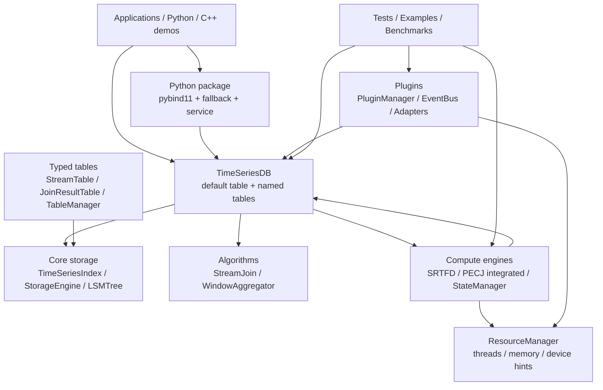
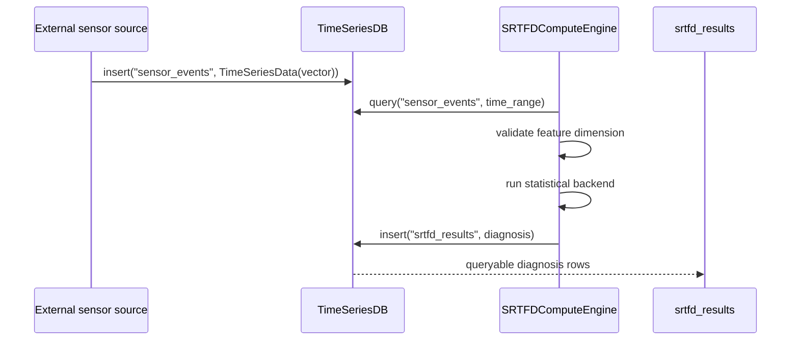
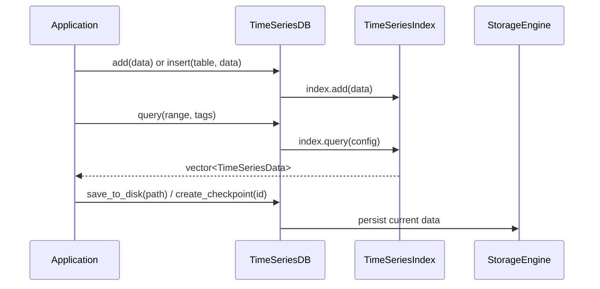
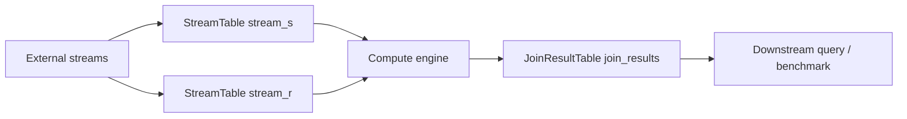
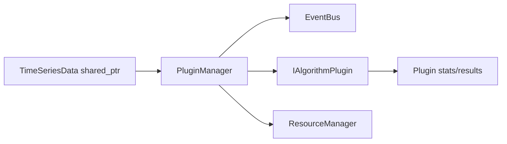

# sageTSDB 系统设计文档

版本: v2026.05
更新日期: 2026-05-30
适用范围: `sageTSDB` 当前代码库

> 文件名沿用历史上的 `DESIGN_DOC_SAGETSDB_PECJ.md`，用于保持已有文档链接可用；本文内容已重写为 sageTSDB 的总体设计文档，不再只描述 PECJ 集成。

## 摘要

sageTSDB 是一个以 C++ 核心为主、Python 绑定为辅的时序数据库与流处理实验平台。当前代码库的核心能力包括：

- 基础时序数据模型、索引、查询和持久化。
- 命名多表 API 与类型化 Stream/Join 表管理。
- LSM-Tree 存储组件、WAL、SSTable、Bloom Filter 和 checkpoint 支持。
- 资源统一管理，包括线程池、内存配额、任务提交和运行时使用上报。
- 内置流处理算法，包括窗口聚合与流式 Join。
- 插件模式，用于 PECJ、故障检测等适配器的独立生命周期管理。
- compute 模式，用于无状态计算引擎，例如 SRTFD 诊断算子，以及可选的 PECJ 深度融合引擎。
- pybind11 C++ 绑定和 Python fallback/service 层。

系统的长期方向是 database-centric：数据先进入 sageTSDB 表，计算只从表读取输入并将结果写回表；线程、内存和执行策略通过 `core::ResourceManager` 显式管理。

## 当前实现状态

| 模块 | 状态 | 主要文件 | 说明 |
| --- | --- | --- | --- |
| 时序数据模型 | 已实现 | `include/sage_tsdb/core/time_series_data.h` | 标量/向量值、tags、fields、时间范围和查询配置。 |
| 默认索引与 DB API | 已实现 | `time_series_db.*`, `time_series_index.*` | 默认表 API 与命名多表 API 并存。 |
| 持久化与 LSM-Tree | 已实现 | `storage_engine.*`, `lsm_tree.*` | StorageEngine 保持高层保存/加载/checkpoint API，底层使用 LSM 组件。 |
| 类型化表系统 | 已实现 | `stream_table.*`, `join_result_table.*`, `table_manager.*` | StreamTable/JoinResultTable 用于计算管道和 PECJ 场景。 |
| 资源管理 | 已实现 | `resource_manager.*` | 位于 `core/`，供插件和 compute engine 共用。 |
| 算法框架 | 已实现 | `algorithms/` | `TimeSeriesAlgorithm`、`StreamJoin`、`WindowAggregator`。 |
| 插件系统 | 已实现 | `plugins/` | `PluginManager`、`PluginRegistry`、`EventBus`、PECJ/FaultDetection adapters。 |
| SRTFD compute engine | 已实现 | `srtfd_compute_engine.*` | 无状态窗口诊断，当前实现 `statistical` backend。 |
| PECJ compute engine | 条件构建 | `pecj_compute_engine.*`, `window_scheduler.*` | 需 `SAGE_TSDB_ENABLE_PECJ=ON` 且 `PECJ_MODE=INTEGRATED`。当前主要返回窗口计算状态和指标；详细结果写表路径仍需继续收口。 |
| ComputeStateManager | 已实现 | `compute_state_manager.*` | 通过 `_compute_state` 和 checkpoint 表保存计算状态。 |
| Python 绑定 | 部分实现 | `sage_tsdb/bindings.cpp`, `sage_tsdb/__init__.py` | C++ core 类型绑定；Python fallback、算法和 service wrapper 总是可用。 |
| Wheel/package | 已实现 | `pyproject.toml`, `sage_tsdb/` | Python runtime 依赖保持最小，当前为 `numpy`。 |

## 设计原则

1. **数据先入库**
   外部数据进入 `TimeSeriesDB` 或类型化表后，计算引擎通过查询接口读取窗口数据。避免计算组件持有另一份长期输入缓冲。

2. **模式边界显式**
   Baseline/plugin 模式与 integrated/compute 模式不能隐式互相 fallback。集成模式初始化失败应 fail-fast。

3. **资源由 core 托管**
   插件和计算引擎通过 `core::ResourceManager` 请求线程、内存和设备资源，避免自行创建不可观测的后台线程池。

4. **计算引擎尽量无状态**
   无状态引擎只保存配置、DB 指针、资源句柄和指标；窗口进度、watermark 或可恢复状态由表或 `ComputeStateManager` 管理。

5. **可选依赖受构建开关控制**
   PECJ/PyTorch 等重依赖只在构建选项启用时进入目标。基础 DB、算法和 Python fallback 不依赖 PECJ。

6. **不引入跨仓库编排职责**
   本仓库负责时序 DB、计算适配、绑定和 benchmark；上层业务工作流、跨仓库发布和环境编排不放入 sageTSDB 核心。

## 总体架构



### 目录边界

| 目录 | 职责 | 不应承担的职责 |
| --- | --- | --- |
| `include/sage_tsdb/core`, `src/core` | 数据模型、索引、存储、表、资源管理。 | 外部算法生命周期、业务流程编排。 |
| `include/sage_tsdb/algorithms`, `src/algorithms` | 内置同步算法和算法注册机制。 | 资源调度、插件模式管理。 |
| `include/sage_tsdb/compute`, `src/compute` | 无状态或可恢复计算引擎、窗口调度、计算状态持久化。 | 持有外部数据源生命周期，隐式启动长期 worker。 |
| `include/sage_tsdb/plugins`, `src/plugins` | 插件适配、事件总线、baseline/integrated 插件生命周期。 | 替代 `core::ResourceManager` 或存储核心。 |
| `sage_tsdb/` | Python 包、C++ 绑定 fallback、Python 算法和 service。 | C++ 构建选项或外部仓库安装编排。 |
| `examples/`, `tests/`, `scripts/` | 示例、验证、benchmark、辅助脚本。 | 核心库公共 API。 |
| `docs/` | 设计与模块文档。 | 与当前代码不一致的状态声明。 |

## 构建与目标组织

根 `CMakeLists.txt` 定义以下主要目标：

| Target | 默认/条件 | 内容 |
| --- | --- | --- |
| `sage_tsdb_core` | 默认 | resource manager、数据模型、索引、DB、storage engine、LSM、typed tables、config。 |
| `sage_tsdb_algorithms` | 默认 | `StreamJoin` 和 `WindowAggregator`。 |
| `sage_tsdb_compute` | 条件 | `SRTFDComputeEngine` 默认启用；PECJ integrated 由开关加入。 |
| `sage_tsdb_plugins` | `BUILD_PLUGINS=ON` | plugin manager、PECJ adapter、fault detection adapter。 |
| `_sage_tsdb` Python extension | `BUILD_PYTHON_BINDINGS=ON` 或 scikit-build | pybind11 绑定。 |
| `sage_tsdb` | interface | 聚合 core 和 algorithms。 |

关键构建选项：

| 选项 | 默认 | 作用 |
| --- | --- | --- |
| `BUILD_TESTS` | `ON` | 构建 GoogleTest 测试。 |
| `BUILD_PYTHON_BINDINGS` | 非 scikit-build 默认 `OFF` | 构建 Python C++ extension。 |
| `BUILD_PLUGINS` | `ON` | 构建插件系统。 |
| `SAGE_TSDB_ENABLE_SRTFD` | `ON` | 将 SRTFD 无状态诊断引擎加入 `sage_tsdb_compute`。 |
| `SAGE_TSDB_ENABLE_PECJ` | `OFF` | 启用 PECJ 相关 compute 目标。 |
| `PECJ_MODE` | `INTEGRATED` | PECJ 模式，当前 CMake 重点支持 integrated compute 条件构建。 |
| `PECJ_FULL_INTEGRATION` | `OFF` | 链接 PECJ 库和 Torch 后启用完整 PECJ 头/库路径。 |
| `PECJ_DIR` | 未设置 | 外部 PECJ 源码/构建目录。 |

注意：由于 PECJ/PyTorch ABI 兼容要求，根 CMake 当前统一定义 `_GLIBCXX_USE_CXX11_ABI=0`。

## 数据模型和查询 API

### TimeSeriesData

`TimeSeriesData` 是系统核心记录类型：

- `timestamp`: `int64_t` 时间戳。
- `value`: `double` 或 `std::vector<double>`。
- `tags`: 可索引字符串键值对，适合 sensor、asset、symbol、stream id 等过滤条件。
- `fields`: 附加元数据，适合单位、原始标签、诊断置信度等非主要索引字段。

`as_double()` 对向量值返回第一个元素；`as_vector()` 对标量值返回单元素向量。

### TimeRange 和 QueryConfig

`TimeRange` 使用 `[start_time, end_time]` 的 inclusive 语义；`QueryConfig` 包含时间范围、tag 过滤、聚合类型、窗口大小和 limit。

### TimeSeriesDB 双层 API

`TimeSeriesDB` 同时提供两类入口：

1. **默认表兼容 API**
   - `add()` / `add_batch()` 写入默认 `TimeSeriesIndex`。
   - `query()` 从默认索引查询。
   - `register_algorithm()` / `apply_algorithm()` 运行内置算法。

2. **命名多表 API**
   - `createTable(name, TableType)` 创建命名表。
   - `insert(table_name, data)` 和 `insertBatch(table_name, data_list)` 写入命名表。
   - `query(table_name, range, filter_tags)` 查询命名表。

当前 `TimeSeriesDB` 的命名表底层是 `TimeSeriesIndex`，适合轻量多表使用。需要 StreamTable/JoinResultTable 的 LSM、窗口、结果聚合等专用能力时，应使用 `TableManager`。

## 存储与表设计

### TimeSeriesIndex

`TimeSeriesIndex` 是默认 DB 和命名表的内存索引，支持插入、批量插入、按时间范围查询、按索引取数、清空和 size/empty 查询。

### StorageEngine 和 LSM-Tree

`StorageEngine` 暴露高层持久化 API：

- `save()` / `load()`。
- `append()`。
- checkpoint 创建、恢复、列举和删除。
- 存储路径和压缩开关。
- 存储统计。

底层 LSM 组件包括 active/immutable MemTable、WAL、SSTable、Bloom Filter、level compaction 和查询合并。文档详见 `docs/core/LSM_TREE_IMPLEMENTATION.md` 和 `docs/core/PERSISTENCE.md`。

### StreamTable

`StreamTable` 是面向流输入的类型化表：

- 支持乱序插入和范围查询。
- 通过 MemTable + Immutable MemTable + LSM-Tree 管理数据。
- 支持标签索引、窗口查询、最新 N 条查询、count 查询。
- 提供 flush、compact、clear 和表级统计。

### JoinResultTable

`JoinResultTable` 复用 StreamTable 存储窗口级 Join 结果，包含：

- `window_id`、timestamp、join count、AQP estimate、selectivity。
- 序列化 payload。
- computation metrics。
- 按窗口、时间范围、标签、最近 N 个窗口查询。
- 聚合统计、旧结果删除和表级统计。

### TableManager

`TableManager` 统一管理类型化表：

- `createStreamTable()`、`createJoinResultTable()`、`createPECJTables()`。
- 类型安全访问 `getStreamTable()`、`getJoinResultTable()`。
- 批量插入/查询、保存/加载所有表、checkpoint 开关。
- 全局统计、flush/compact 所有表和全局内存限制。

## 资源管理

`core::ResourceManager` 是跨插件和 compute engine 的资源入口。主要抽象：

- `ResourceRequest`: 请求线程数、内存软/硬限制、GPU id、model path 和优先级。
- `ResourceUsage`: 当前线程、内存、队列长度、吞吐、延迟和错误。
- `ResourceHandle`: 异步提交任务、检查有效性、查询实际分配、上报使用情况。
- `ResourceManager`: allocate/release/query/adjustQuota/global limits/pressure 检测，以及 compute 专用的 `allocateForCompute()` / `releaseCompute()` / `getComputeUsage()` / `throttleCompute()`。

设计约束：

- integrated 模式必须显式获得 resource handle。
- 插件和计算引擎不应绕过 ResourceManager 创建不可控线程池。
- GPU 资源字段目前是接口预留，实际设备调度仍需后续实现。

## 算法层

算法层提供同步、库内、轻量的时序处理能力：

- `TimeSeriesAlgorithm`: 抽象基类，定义 `process()`、`reset()`、`get_stats()` 和 key-value config。
- `AlgorithmFactory` 与 `REGISTER_ALGORITHM`: 用于算法注册和按名称创建。
- `StreamJoin`: 时间窗口内的双流 Join，支持乱序场景的基础处理。
- `WindowAggregator`: 支持 SUM、AVG、COUNT、MIN、MAX 等窗口聚合。

算法层适合直接在调用方内同步执行；需要资源隔离、状态恢复、插件生命周期或外部算法适配时，应使用 compute 或 plugins 层。

## Compute 层

compute 层是 database-centric 的计算引擎层。它与插件层的区别是：compute engine 不通过 `feedData()` 长期接收数据，而是在执行窗口任务时从 DB/表查询输入。

### SRTFDComputeEngine

当前 SRTFD 是默认启用的无状态诊断算子：

- 入口: `SRTFDComputeEngine::initialize(config, db, resource_handle)`。
- 执行: `executeWindowDiagnosis(window_id, TimeRange)`。
- 输入表: 默认 `sensor_events`。
- 输出表: 默认 `srtfd_results`。
- 当前 backend: `statistical`，用于无模型文件环境下的稳定测试。
- 预留 backend: `torchscript`、`external`，当前 fail-fast，待接入模型 artifact。

执行流程：



SRTFD 不持有训练 buffer、optimizer、伪标签或 continual-learning 任务状态。SRTFD 原仓库的训练流程仍在外部维护；sageTSDB 侧只接入推理/诊断语义。

### PECJComputeEngine

PECJ integrated 模式由以下条件启用：

```bash
cmake -B build -S . \
  -DSAGE_TSDB_ENABLE_PECJ=ON \
  -DPECJ_MODE=INTEGRATED \
  -DPECJ_DIR=/path/to/PECJ
```

启用后，`sage_tsdb_compute` 会加入 `pecj_compute_engine.cpp` 和 `window_scheduler.cpp`，并定义 `PECJ_MODE_INTEGRATED`。如果发现 PECJ 库且启用 `PECJ_FULL_INTEGRATION`，会进一步链接 PECJ 和 Torch。

目标设计：

- 从 `stream_s` / `stream_r` 查询窗口数据。
- 转换为 PECJ tuple。
- 调用 IAWJ、IMA、MSWJ、SHJ、PRJ 等 PECJ operator。
- 返回 `ComputeStatus` 和 `ComputeMetrics`。
- 通过 WindowScheduler 自动触发窗口计算。

当前注意事项：

- stub 模式可构建接口和部分测试。
- full integration 依赖外部 PECJ/Torch 环境。
- 详细 join payload 的结果写表路径在代码中仍需继续完善；不要把旧文档中的“完整结果写回已完成”视为当前事实。

### WindowScheduler

`WindowScheduler` 负责 PECJ integrated 场景下的窗口触发：

- 窗口类型: Tumbling、Sliding、Session、IntraWindow、MultiStream。
- 触发策略: TimeBased、CountBased、Hybrid、Watermark、Manual。
- 支持 watermark、late data 标记、pending/active window 管理。
- 通过 callback 上报完成或失败状态。

目前它与 `PECJComputeEngine` 强绑定；后续若引入通用 compute scheduler，可以将 SRTFD 等引擎统一纳入调度。

### ComputeStateManager

`ComputeStateManager` 管理可序列化计算状态：

- 状态表: `_compute_state`。
- checkpoint 表: `_compute_checkpoint`。
- 支持 save/load/has/delete/list/persist/checkpoint/restore。
- `ComputeState` 包含 compute name、timestamp、watermark、window id、processed events、operator state 和 metadata。

## 插件层

插件层用于 baseline 模式、适配外部算法和事件驱动处理。核心接口：

- `IAlgorithmPlugin`: initialize、resource-managed initialize、feedData、process、getStats、reset、start、stop、name/version。
- `PluginRegistry`: 静态注册和按名称创建插件。
- `PluginManager`: 生命周期、ResourceManager、EventBus、启停、feed、统计、启用/禁用。
- `EventBus`: 数据、结果、错误和指标事件的发布订阅。

`PluginManager::loadPlugin()` 当前通过配置中的 `mode` 字段显式选择：

- `baseline`: 调用插件普通 `initialize(config)`。
- `integrated`: 先从 ResourceManager 分配资源，再调用插件 `initialize(config, request, handle)`。

若 mode 不是 `baseline|integrated`，或 integrated 初始化不支持，则失败。该行为符合 ADR 0001：不做静默 fallback。

当前内置适配器：

- `PECJAdapter`: baseline/plugin PECJ 适配器，支持异步 feed 和插件生命周期。
- `FaultDetectionAdapter`: z-score/VAE/hybrid 风格故障检测适配器，VAE 路径当前以 stub 方式保留扩展点。

## Python 层

Python 包名为 `isage-tsdb`，源码包目录为 `sage_tsdb/`。

当前 Python 层包括：

- `_sage_tsdb` pybind11 extension，绑定 `TimeSeriesData`、`TimeRange`、`QueryConfig`、`TimeSeriesDB`、`TimeSeriesIndex`。
- Python fallback core，在 C++ extension 不可用时提供同名核心类型。
- Python-only `AggregationType`、`InterpolationType`。
- Python 算法: `OutOfOrderStreamJoin`、`WindowAggregator`、`TimeSeriesAlgorithm`。
- `SageTSDBService` 和配置封装。

`pyproject.toml` 当前运行时依赖最小化为 `numpy>=1.26.0,<2.3.0`；开发依赖通过 optional `dev` 安装。

## 典型数据流

### 基础写入和查询



### 类型化流表和计算结果



### 插件 baseline 模式



## 测试与验证

当前 CMake 测试覆盖：

- core: `test_time_series_data`、`test_time_series_index`、`test_time_series_db`、`test_storage_engine`、`test_table_design`。
- algorithms: `test_stream_join`、`test_window_aggregator`。
- compute: `test_srtfd_compute_engine` 默认随 SRTFD 开关构建；PECJ compute/window tests 随 PECJ integrated 条件构建。
- plugins: `test_pecj_plugin`、`test_fault_detection_plugin`、`test_resource_manager`、`test_integrated_mode` 随插件目标构建。

常用命令：

```bash
cmake -B build -S . -DBUILD_TESTS=ON
cmake --build build -j$(nproc)
ctest --test-dir build --output-on-failure
```

只验证 SRTFD compute：

```bash
cmake -B build -S . -DBUILD_TESTS=ON -DSAGE_TSDB_ENABLE_SRTFD=ON
cmake --build build --target test_srtfd_compute_engine -j$(nproc)
./build/tests/test_srtfd_compute_engine
```

PECJ integrated 验证需要外部 PECJ 目录和可用依赖：

```bash
cmake -B build -S . \
  -DBUILD_TESTS=ON \
  -DSAGE_TSDB_ENABLE_PECJ=ON \
  -DPECJ_MODE=INTEGRATED \
  -DPECJ_DIR=/path/to/PECJ
cmake --build build --target test_pecj_compute_engine -j$(nproc)
```

## 已知限制

1. **PECJ 结果写回仍需收口**
   当前 PECJ compute 的核心状态和指标路径可用，但详细 join result payload 写入 result table 的实现仍需要按当前 API 重新整理。

2. **通用 compute scheduler 尚未抽象**
   WindowScheduler 当前面向 PECJ；SRTFD 使用手动窗口执行接口。未来可以抽象 `IComputeEngine` 与统一 scheduler。

3. **GPU 资源管理仅预留接口**
   `ResourceRequest::gpu_ids` 存在，但没有完整设备分配和 GPU 内存配额实现。

4. **Python 绑定未覆盖全部 C++ 能力**
   当前 pybind11 主要绑定 core 类型和默认 DB API；compute、plugins、typed tables 尚未完整暴露。

5. **安装导出目标偏核心库**
   当前 install/package 重点覆盖 core、algorithms 和 Python extension；compute/plugins 的安装导出策略需要后续明确。

6. **部分文档仍是历史 PECJ 语境**
   模块文档中可能保留性能数字或状态描述，应以当前代码和本设计文档为准。

## Roadmap

### P0: 当前架构收口

- 完成 PECJ result table 写回路径与测试。
- 统一 `TimeSeriesDB` 轻量多表 API 与 `TableManager` 类型化表 API 的定位说明和示例。
- 修正文档索引中仍指向旧路径或旧状态的描述。
- 明确 compute/plugins 的 install/export 策略。

### P1: Compute 统一化

- 引入通用 `IComputeEngine` 或等价概念，统一 PECJ、SRTFD 和后续异常检测引擎的生命周期。
- 将 WindowScheduler 从 PECJ 专用调度器演进为可配置 compute scheduler。
- 将 ComputeStateManager 接入更多 compute engine 的恢复路径。

### P2: 模型与 Python 能力

- 为 SRTFD 接入 TorchScript 或外部推理 backend，并保持模型 artifact immutable。
- 扩展 Python 绑定，覆盖命名表、compute engine 配置和结果查询。
- 增加 Python 层 benchmark 和服务化示例。

### P3: 资源与规模化

- 实现 GPU 资源分配和设备内存配额。
- 增加长时间压力测试、大规模乱序数据测试和 benchmark 可视化基线。
- 规划分布式表或远程 compute engine 调度。

## 代码索引

```text
include/sage_tsdb/
  core/
    time_series_data.h
    time_series_index.h
    time_series_db.h
    storage_engine.h
    lsm_tree.h
    stream_table.h
    join_result_table.h
    table_manager.h
    resource_manager.h
  algorithms/
    algorithm_base.h
    stream_join.h
    window_aggregator.h
  compute/
    srtfd_compute_engine.h
    pecj_compute_engine.h
    window_scheduler.h
    compute_state_manager.h
  plugins/
    plugin_interface.h
    plugin_registry.h
    plugin_manager.h
    event_bus.h
    adapters/pecj_adapter.h
    adapters/fault_detection_adapter.h

src/ implementation mirrors include/ by module.

sage_tsdb/
  bindings.cpp
  __init__.py
  core.py
  algorithms/
  service/

docs/
  README.md
  adr/0001-boundary-and-mode-policy.md
  core/
  compute/
  plugins/
  algorithms/
  examples/
```

## 相关文档

- `docs/adr/0001-boundary-and-mode-policy.md`: 仓库职责、模式边界和禁止模式。
- `docs/core/README.md`: core 模块总览。
- `docs/core/LSM_TREE_IMPLEMENTATION.md`: LSM-Tree 实现。
- `docs/core/PERSISTENCE.md`: 持久化和 checkpoint。
- `docs/core/TABLE_DESIGN_IMPLEMENTATION.md`: StreamTable、JoinResultTable、TableManager。
- `docs/core/RESOURCE_MANAGER_GUIDE.md`: ResourceManager 使用与调优。
- `docs/compute/SRTFD_STATELESS_OPERATOR_DESIGN.md`: SRTFD 无状态算子设计。
- `docs/compute/PECJ_COMPUTE_ENGINE_IMPLEMENTATION.md`: PECJ compute engine 历史实现说明。
- `docs/compute/PECJ_OPERATORS_INTEGRATION.md`: PECJ 算子列表。
- `docs/plugins/README.md`: 插件系统总览。
- `docs/algorithms/README.md`: 内置算法总览。

## 维护规则

- 修改核心架构、构建开关、公共 API 或模式边界时，需要同步更新本文档。
- 若文档与代码冲突，以当前代码和测试为准，并优先修正文档。
- 不新增静默 fallback、shim/re-export 或跨仓库依赖来掩盖迁移问题。
- 任何新增 compute/plugin 都应说明数据入口、结果出口、资源管理方式和测试目标。