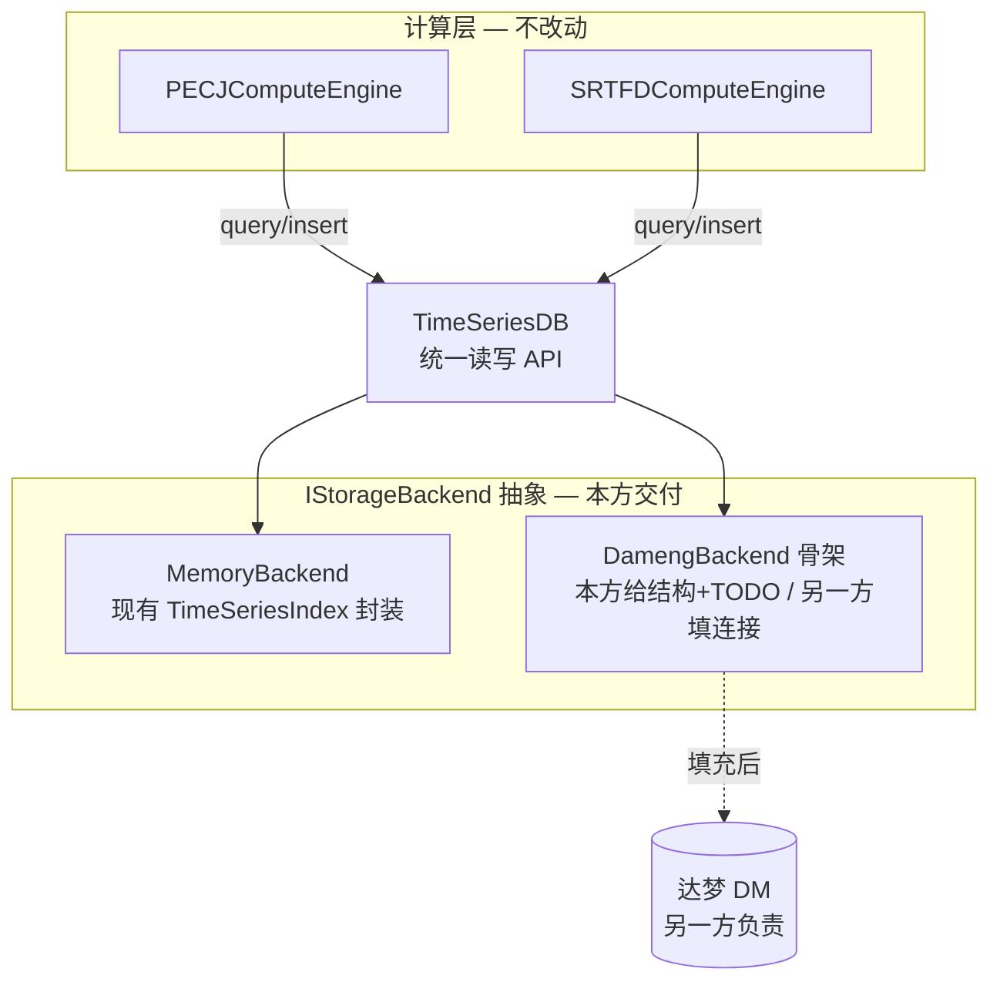
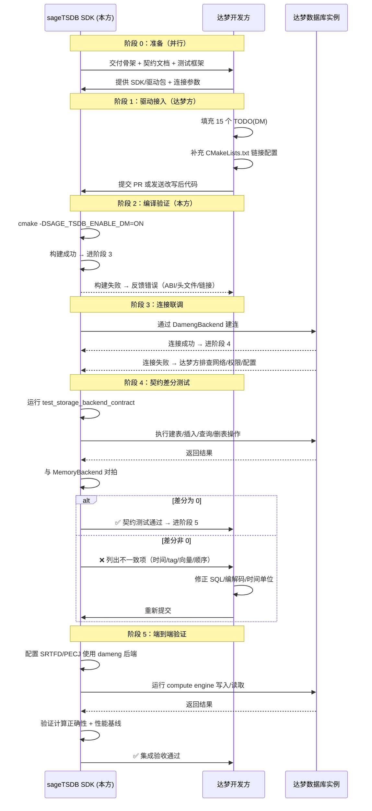

# sageTSDB × 企业级数据库（达梦 DM）集成 — SDK 库开发执行计划

版本: v0.2（草案）
日期: 2026-07-06
适用范围: `sageTSDB` 当前代码库
课题目标: 完成 SDK（库）功能开发，为把 **PECJ** 与 **SRTFD** 接入企业级数据库（达梦 DM）做数据库集成与适配
关联文档: [DESIGN_DOC_SAGETSDB_PECJ.md](DESIGN_DOC_SAGETSDB_PECJ.md)、[adr/0001-boundary-and-mode-policy.md](adr/0001-boundary-and-mode-policy.md)

---

## 1. 分工与交付边界（本计划的前提）

本课题的数据库集成分为两侧，本计划**只负责 SDK 库一侧**：

| | 负责方 | 职责 |
| --- | --- | --- |
| **SDK 库侧（本计划）** | 本方 | 存储后端抽象接口、Mock/内存后端、**达梦适配器骨架（TODO 占位）**、文档、环境/构建配置。语言以 **C++ core** 为主。 |
| **达梦实例侧** | 课题另一方 | 真实达梦部署、schema、数据、驱动连接；把连接/SQL 代码填入本方交付的适配器骨架。 |

**对接点（Handoff）= 本方交付的 `IStorageBackend` 契约 + 适配器骨架里标注好的填充位（TODO）。** 双方通过这个接口对接，互不阻塞：

- 本方不需要真实达梦实例即可完成开发、编译和测试（用 Mock/内存后端）。
- 另一方拿到骨架和契约文档后，只需实现接口方法，无需理解 PECJ/SRTFD 或 sageTSDB 内部。

> **本计划不包含**：真实达梦连接联调、schema 落地、数据导入、端到端跑通达梦。这些属于达梦实例侧，或在双方联调阶段进行（见 §7）。

### 关键结论（决定整个设计）

> **PECJ 和 SRTFD 的计算逻辑不需要改。** 它们已是 database-centric：只通过 `TimeSeriesDB` 的 `query()` / `insert()` / `createTable()` 读写数据，不持有外部数据源。
> 因此 SDK 侧的工作是：**给 `TimeSeriesDB` 抽出一个可插拔存储后端接口 `IStorageBackend`，默认走内存实现（现状不变），并预留达梦适配器骨架供另一方填充。**

这把课题从"改两个算法"收敛为"加一层存储抽象 + 定义清晰的对接契约 + 交付可编译的骨架"。

---

## 2. 现状分析（基于当前代码）

### 2.1 数据只从一个入口进出

两个计算引擎对数据的全部访问，都集中在对 `TimeSeriesDB` 指针的少数几次调用上：

| 引擎 | 文件 | 读 | 写 | 建表/判存 |
| --- | --- | --- | --- | --- |
| SRTFD | [src/compute/srtfd_compute_engine.cpp](../src/compute/srtfd_compute_engine.cpp) | `db_->query(input_table, time_range)` (L143) | `db_->insert(result_table, result)` (L300) | `db_->hasTable` (L93/96)、`db_->createTable` (L97) |
| PECJ | [src/compute/pecj_compute_engine.cpp](../src/compute/pecj_compute_engine.cpp) | `db_->query(stream_s_table, range)`、`db_->query(stream_r_table, range)` (L275-276) | 结果写回（L553 附近，本就需收口） | 依赖表已建 |

引擎初始化签名统一：`initialize(config, TimeSeriesDB* db, core::ResourceHandle* resource_handle)`。**只要 `TimeSeriesDB` 的读写能切换到其他后端，引擎代码零改动。**

### 2.2 当前 TimeSeriesDB 的存储是硬编码的内存实现

[include/sage_tsdb/core/time_series_db.h](../include/sage_tsdb/core/time_series_db.h) 里：

- `std::unique_ptr<TimeSeriesIndex> index_;`（默认表）
- `std::unordered_map<std::string, std::unique_ptr<TimeSeriesIndex>> tables_;`（命名多表）
- `std::unique_ptr<StorageEngine> storage_engine_;`（本地 LSM 文件持久化）

`TimeSeriesIndex`（[include/sage_tsdb/core/time_series_index.h](../include/sage_tsdb/core/time_series_index.h)）是纯内存的 `std::vector<TimeSeriesData> data_` + tag 倒排索引。**当前没有任何存储后端抽象接口**——这是 SDK 侧要补的第一块，也是对接达梦的插槽。

### 2.3 相关真实类型（契约以此为准）

以下签名摘自当前头文件，接口契约必须与之一致：

```cpp
// include/sage_tsdb/core/time_series_data.h
using TimeSeriesValue = std::variant<double, std::vector<double>>;  // 标量或向量
using Tags   = std::map<std::string, std::string>;                 // 可索引
using Fields = std::map<std::string, std::string>;                 // 元数据

struct TimeSeriesData {
    int64_t timestamp;      // 【契约固定：微秒 μs】结构体注释历史写作毫秒，本契约统一按微秒解释与存取
    TimeSeriesValue value;  // double 或 vector<double>（SRTFD 默认 52 维）
    Tags tags;
    Fields fields;
};

struct TimeRange { int64_t start_time; int64_t end_time; };   // 两端 inclusive
struct QueryConfig {
    TimeRange time_range;
    Tags filter_tags;
    AggregationType aggregation = AggregationType::NONE;
    int64_t window_size = 0;
    int32_t limit = 1000;
};
```

`TableType`（[time_series_db.h](../include/sage_tsdb/core/time_series_db.h)）：`TimeSeries / Stream / JoinResult / ComputeState`。

**时间语义（契约固定）**：所有经过 `IStorageBackend` 的 `timestamp`、`TimeRange.start_time`/`end_time`、`QueryConfig.window_size` 一律以**微秒（μs）** 为单位。`TimeRange` 两端 **inclusive**。达梦侧 `timestamp` 列存微秒整数（`BIGINT`），不做隐式单位换算；任何毫秒来源数据必须在进入后端前转换。

### 2.4 达梦驱动尚不存在

全仓库检索 `dameng / DM8 / dmPython / dpi.h` 只命中路径字符串，**没有任何达梦连接代码**。本方交付骨架，连接代码由另一方填充。

---

## 3. 核心设计：可插拔存储后端（SDK 契约）

### 3.1 目标架构



### 3.2 抽象接口 `IStorageBackend`（本方交付①）

新增 `include/sage_tsdb/core/storage_backend.h`，覆盖 `TimeSeriesDB` 当前对索引的全部依赖：

```cpp
namespace sage_tsdb::core {

// 后端只负责“表 × 时序记录”的读写，不承担计算、调度、资源管理
class IStorageBackend {
public:
    virtual ~IStorageBackend() = default;

    // 表管理
    virtual bool createTable(const std::string& name, TableType type) = 0;
    virtual bool dropTable(const std::string& name) = 0;
    virtual bool hasTable(const std::string& name) const = 0;
    virtual std::vector<std::string> listTables() const = 0;

    // 写入（返回值语义与现 TimeSeriesDB::insert 一致）
    virtual size_t insert(const std::string& table, const TimeSeriesData& d) = 0;
    virtual std::vector<size_t> insertBatch(const std::string& table,
                                            const std::vector<TimeSeriesData>& d) = 0;

    // 查询（时间范围 + tag 过滤 + limit，语义对齐 QueryConfig）
    virtual std::vector<TimeSeriesData> query(const std::string& table,
                                              const QueryConfig& cfg) const = 0;

    // 统计 / 生命周期
    virtual size_t size(const std::string& table) const = 0;
    virtual void   clear(const std::string& table) = 0;
    virtual bool   flush() = 0;   // 提交/落盘；内存后端可为 no-op

    // 后端标识（便于日志与显式模式判断）
    virtual std::string backendName() const = 0;
};

} // namespace sage_tsdb::core
```

配套一个后端工厂 / 配置结构（`StorageBackendConfig`：backend 名、连接参数 key-value），供 `TimeSeriesDB` 按显式配置选择后端。

### 3.3 MemoryBackend（本方交付②，兼回归基线）

把现有 `TimeSeriesIndex` 逻辑封装为 `IStorageBackend` 实现，作为默认后端。目标是**"不启用达梦时，行为与当前完全一致"**——现有所有测试不改一行即通过。这既是默认实现，也是达梦后端的差分测试对照组。

### 3.4 DamengBackend 骨架（本方交付③，TODO 占位）

新增 `include/sage_tsdb/core/backends/dameng_backend.h` 与 `src/core/backends/dameng_backend.cpp`：

- 完整实现 `IStorageBackend` 的**类结构、方法签名、参数校验、错误路径、日志点**。
- 真正的连接/SQL/绑定处，用清晰的 `// TODO(DM):` 占位并配注释说明期望行为、输入输出、约束。
- 在未填充（或未启用 `SAGE_TSDB_ENABLE_DM`）时，方法应 **fail-fast 返回明确错误**（遵循 ADR 0001，禁止静默 fallback 到内存）。
- 交付时**可编译**（骨架不依赖真实达梦库即可 build；真实驱动作为可选依赖）。

TODO 占位示例（骨架里标注给另一方的填充位）：

```cpp
size_t DamengBackend::insert(const std::string& table, const TimeSeriesData& d) {
    // 契约：把一条记录写入达梦表 ts_<table>，返回该表当前行序号语义的 id
    // 输入：d.timestamp(int64 ms)、d.value(标量或向量)、d.tags、d.fields
    // 约束：参数化绑定，禁止字符串拼接 SQL；批量走 insertBatch
    // TODO(DM): 用达梦驱动（DPI/ODBC）实现参数化插入
    throw NotImplemented("DamengBackend::insert — DM driver not wired");
}
```

### 3.5 表结构映射建议（写进契约文档，供另一方参考）

`TimeSeriesData` 字段 → 达梦表设计建议（**最终 DDL 由另一方决定**，本方只给映射契约）：

| sageTSDB 概念 | 达梦表设计建议 | 说明 |
| --- | --- | --- |
| 命名表（如 `stream_s`） | 物理表 `ts_stream_s` | 前缀避免冲突 |
| `timestamp` | `BIGINT` + 索引 | 范围查询主路径 |
| 标量 `value` | `DOUBLE` | 标量场景 |
| 向量 `value`（SRTFD 52 维） | `VARBINARY`/`BLOB` 序列化 **或** 宽表 `f0..f51` | 见 §3.6 |
| `tags` | 高频过滤 tag 拆列 + 索引，或 `CLOB(JSON)` | 过滤下推优先 |
| `fields` | `CLOB(JSON)` | 非索引元数据 |

### 3.6 向量值序列化（SRTFD 关键点，本方给定字节格式）

SRTFD 默认 `input_dim = 52`，每条样本是 52 维向量。`value` 是 `std::variant<double, std::vector<double>>`，两种形态都用**同一套字节格式**编码进达梦的 `VARBINARY`/`BLOB` 列（方案 A）。本方给定格式，Mock 与达梦共用同一编解码器，配单元测试保证往返一致。

**字节格式 `stsb1`（sageTSDB blob v1），全部小端（little-endian）：**

| 偏移 | 大小(字节) | 字段 | 说明 |
| --- | --- | --- | --- |
| 0 | 4 | magic | ASCII `"STSB"`（0x53 0x54 0x53 0x42） |
| 4 | 1 | version | `0x01` |
| 5 | 1 | kind | `0x01`=标量 double；`0x02`=向量 double[] |
| 6 | 2 | reserved | 置 0，对齐用 |
| 8 | 4 | count | 元素个数（`uint32`）：标量恒为 1，向量为维度数（如 52） |
| 12 | 8×count | data | `count` 个 IEEE-754 `double`（每个 8 字节，小端） |

- 总长度 = `12 + 8 × count` 字节。标量为 20 字节，52 维向量为 428 字节。
- 解码时校验 magic、version、`kind` 与 `count` 的一致性（标量必须 `count==1`）；不匹配 fail-fast。
- 契约文档（D5）会附上该格式的编码/解码参考实现和测试向量（含一条标量、一条 52 维样例的十六进制）。

方案 B（宽表 `f0..f51`）作为可选优化留在文档，不进第一版骨架。

---

## 4. 交付物清单（对应本课题 SDK 库开发）

| # | 交付物 | 内容 | 形式 |
| --- | --- | --- | --- |
| D1 | **抽象接口（头文件/契约）** | `IStorageBackend` + `StorageBackendConfig` + 后端工厂；**每个公共方法配 Doxygen 注释** | `include/sage_tsdb/core/storage_backend.h` |
| D2 | **Mock/内存后端实现** | `MemoryBackend`（封装 `TimeSeriesIndex`），默认后端 & 回归基线；公共方法配 Doxygen 注释 | `include/sage_tsdb/core/backends/memory_backend.h` + `src/core/backends/memory_backend.cpp` |
| D3 | **达梦适配器骨架（TODO 占位）** | `DamengBackend` 完整结构 + 填充点 + fail-fast；**每个方法 + 每个 `// TODO(DM):` 配 Doxygen/契约注释** | `include/sage_tsdb/core/backends/dameng_backend.h` + `src/core/backends/dameng_backend.cpp` |
| D4 | **TimeSeriesDB 改造** | 内部改为持有 `IStorageBackend`，按配置注入后端 | 改 `time_series_db.{h,cpp}` |
| D5 | **文档** | 接口契约说明、达梦适配对接指南（另一方如何填 TODO）、表映射与序列化约定、配置说明 | `docs/STORAGE_BACKEND_CONTRACT.md`（新增）+ 更新设计文档 |
| D6 | **环境/构建配置** | `SAGE_TSDB_ENABLE_DM` 开关、达梦库探测模板、连接配置模板 | 改 `CMakeLists.txt` + 配置样例 |
| D7 | **测试** | Mock 后端回归（旧测试全绿）+ 针对接口契约的后端一致性测试脚手架 | `tests/` |

---

## 5. 分阶段执行计划（SDK 侧，均不需真实达梦）

### 阶段 1：存储后端抽象 + 内存后端（D1、D2、D4）✅ 已完成

- [x] 新增 `IStorageBackend`（§3.2）与 `StorageBackendConfig`、后端工厂。
- [x] 实现 `MemoryBackend`：封装现有 `TimeSeriesIndex`，逐字段对齐当前语义。
- [x] 改造 `TimeSeriesDB`：内部持有 `std::unique_ptr<IStorageBackend>`，默认注入 `MemoryBackend`；`query/insert/createTable/...` 转发到后端。
- [x] **验收门禁**：现有全部测试（`test_time_series_db`、`test_srtfd_compute_engine` 等）**不改一行、全绿**。这是零行为变化的证明。

### 阶段 2：达梦适配器骨架 + 构建开关（D3、D6）✅ 已完成

- [x] CMake 新增 `option(SAGE_TSDB_ENABLE_DM OFF)` + 达梦库 `find_library`/`find_path` 模板（缺失时给清晰提示，不静默跳过）。
- [x] 编写 `DamengBackend` 骨架：完整方法签名、参数校验、错误路径、日志点、`// TODO(DM):` 填充位与注释契约（§3.4）。**15 个 `TODO(DM)` 填充点就绪**。
- [x] 未启用/未填充时 fail-fast，明确报错，**绝不回退内存**（ADR 0001）。
- [x] **验收**：`-DSAGE_TSDB_ENABLE_DM=OFF` 默认构建不受影响；`-DSAGE_TSDB_ENABLE_DM=ON` 但无真实驱动时，骨架仍可编译，运行时对未实现方法明确报错。

### 阶段 3：契约文档与对接指南（D5）✅ 已完成

- [x] [docs/STORAGE_BACKEND_CONTRACT.md](STORAGE_BACKEND_CONTRACT.md)：逐方法说明输入/输出/线程安全/错误语义/`limit`/tag 过滤/时间范围边界（inclusive）等。
- [x] 达梦对接指南：另一方"如何填 TODO"、表映射建议、向量序列化约定（§4 `stsb1` 含固定字节向量）、连接配置字段清单、凭据从环境变量读取的约定、ABI 约束。
- [ ] 更新 [DESIGN_DOC_SAGETSDB_PECJ.md](DESIGN_DOC_SAGETSDB_PECJ.md) 增补"存储后端抽象与达梦适配"章节（设计文档维护规则要求同步）——待后续与主设计文档一起收口。

### 阶段 4：后端一致性测试脚手架（D7）✅ 已完成

- [x] 后端无关读写用例 `runContractSuite()`（建表→批量插入→闭区间范围→tag 过滤→limit→向量往返→清空→删表→缺表抛错），见 [tests/test_storage_backend_contract.cpp](../tests/test_storage_backend_contract.cpp)。
- [x] `stsb1` 编解码器 [include/sage_tsdb/core/value_codec.h](../include/sage_tsdb/core/value_codec.h) + 往返/固定字节向量测试。
- [x] 对 `MemoryBackend` 全绿；`DamengBackend` 用例在 `SAGE_TSDB_ENABLE_DM=ON` 时编译，驱动未填充时 `GTEST_SKIP`（pending），填充后自动变真实差分测试。
- [x] **验收**：全套 167/167（原 162 + 新增 5）；达梦侧差分框架就绪、标注 pending。

### 阶段 5（可选，双方联调）：达梦真实链路

- 由另一方填充 `DamengBackend` 的 TODO 后，双方联调：内存后端 vs 达梦后端差分为 0，再跑 SRTFD/PECJ 端到端。**此阶段不在本方 SDK 交付范围内**，列出仅为衔接。

---

## 6. 当前实施状态总结（2026-08-10）

### 6.1 已交付代码清单

| 交付物 | 文件 | 状态 | 说明 |
| --- | --- | --- | --- |
| **抽象接口** | [include/sage_tsdb/core/storage_backend.h](../include/sage_tsdb/core/storage_backend.h) | ✅ | `IStorageBackend` 接口 11 个方法 + 工厂注册 + 配置类 |
| | [src/core/storage_backend.cpp](../src/core/storage_backend.cpp) | ✅ | 单例工厂实现（跨 .so 唯一） |
| **内存后端** | [include/sage_tsdb/core/backends/memory_backend.h](../include/sage_tsdb/core/backends/memory_backend.h) | ✅ | 封装 `TimeSeriesIndex`，默认后端 & 回归基线 |
| | [src/core/backends/memory_backend.cpp](../src/core/backends/memory_backend.cpp) | ✅ | 全方法实现 + 自动注册为 `"memory"` |
| **达梦骨架** | [include/sage_tsdb/core/backends/dameng_backend.h](../include/sage_tsdb/core/backends/dameng_backend.h) | ✅ | PIMPL 结构，零达梦头文件依赖 |
| | [src/core/backends/dameng_backend.cpp](../src/core/backends/dameng_backend.cpp) | ✅ | **15 个 `TODO(DM)` 填充点**，每个配契约注释；自动注册为 `"dameng"` |
| **TimeSeriesDB 改造** | [include/sage_tsdb/core/time_series_db.h](../include/sage_tsdb/core/time_series_db.h) | ✅ | 内部替换为 `unique_ptr<IStorageBackend>` |
| | [src/core/time_series_db.cpp](../src/core/time_series_db.cpp) | ✅ | 路由 API 到后端；保留表名过滤逻辑 |
| **值编解码器** | [include/sage_tsdb/core/value_codec.h](../include/sage_tsdb/core/value_codec.h) | ✅ | `stsb1` 字节格式（标量 20B / 52 维 428B）|
| **契约文档** | [docs/STORAGE_BACKEND_CONTRACT.md](STORAGE_BACKEND_CONTRACT.md) | ✅ | 211 行：逐方法契约表 + 达梦对接指南 + 固定测试向量 |
| **一致性测试** | [tests/test_storage_backend_contract.cpp](../tests/test_storage_backend_contract.cpp) | ✅ | 差分测试套件 + stsb1 编解码验证（5/5 通过）|
| **构建配置** | [CMakeLists.txt](../CMakeLists.txt):186-204 | ✅ | `SAGE_TSDB_ENABLE_DM` 开关 + `TODO(DM)` 链接模板 |

### 6.2 测试验收结果

- **全局回归**：167/167 测试通过（含原有 162 + 新增 5），零行为变化 ✅
- **后端契约测试**：`MemoryBackend` 差分基线全绿 ✅
- **达梦骨架编译**：`-DSAGE_TSDB_ENABLE_DM=ON` 时无驱动依赖仍可构建，运行时抛 `NotImplemented` 清晰报错 ✅
- **benchmark 端到端**：`performance_benchmark` 完整 48 组 + `pecj_integrated_vs_plugin_benchmark` 全通过 ✅

### 6.3 待填充工作（达梦方接手点）

达梦适配器 `src/core/backends/dameng_backend.cpp` 内 **15 个 `TODO(DM)` 填充点**：

| 方法 | TODO 数 | 填充内容 |
| --- | --- | --- |
| `ensureConnected()` | 1 | 连接建立（DPI/ODBC）+ 错误处理 |
| `createTable()` | 1 | DDL：`CREATE TABLE IF NOT EXISTS` + 列定义 |
| `dropTable()` | 1 | DDL：`DROP TABLE IF EXISTS` |
| `hasTable()` | 1 | 目录查询：表是否存在 |
| `listTables()` | 1 | 目录查询：返回去前缀的逻辑表名列表 |
| `insert()` | 1 | 参数化单行插入 + `stsb1` 编码 |
| `insertBatch()` | 1 | **性能关键**：批量绑定 + 单事务 |
| `query()` | 1 | 参数化查询：闭区间时间范围 + tag 过滤 + limit + `stsb1` 解码 |
| `size()` | 1 | `SELECT COUNT(*)` |
| `clear()` | 1 | `TRUNCATE TABLE` 或 `DELETE` |
| `flush()` | 1 | 事务提交/落盘 |
| **CMakeLists.txt** | 4 行 | `find_path` / `find_library` / `target_include_directories` / `target_link_libraries` |

---

## 7. 里程碑与工作量估算（SDK 侧）

| 里程碑 | 交付物 | 估算 | 实际状态 |
| --- | --- | --- | --- |
| M1 抽象层 + 内存后端落地 | D1、D2、D4，旧测试全绿 | ~2 天 | ✅ 完成 |
| M2 达梦骨架 + 构建开关 | D3、D6，两种开关均可编译 | ~2 天 | ✅ 完成 |
| M3 契约文档与对接指南 | D5 | ~1.5 天 | ✅ 完成 |
| M4 一致性测试脚手架 | D7 | ~1 天 | ✅ 完成 |

**SDK 侧开发已完成**（实际耗时约 6 个工作日）。当前进入 **M5 联调准备阶段**（见 §9）。

---

## 8. 风险与对策

| 风险 | 影响 | 对策 |
| --- | --- | --- |
| 接口契约与另一方达梦能力不匹配（如某查询无法下推） | 联调返工 | 契约文档明确"必须实现 vs 可选下推"；查询语义以 `MemoryBackend` 为准绳 |
| timestamp 单位不一致（data.h 注释毫秒，PECJ adapter 用微秒） | 时间范围查询错位 | **已定：契约统一微秒（§时间语义）。** 毫秒来源数据在进入后端前转换；达梦列存微秒 BIGINT |
| 向量序列化格式双方理解不一致 | 52 维数据往返出错 | **已定：本方给定字节格式 `stsb1`（§3.6）。** Mock 与达梦共用同一编解码器 + 测试向量 |
| 引入静默 fallback（达梦失败回退内存）掩盖问题 | 违反 ADR 0001 | 后端显式配置；失败 fail-fast；骨架未实现方法明确报错 |
| `_GLIBCXX_USE_CXX11_ABI=0` 与达梦库 ABI 冲突 | 另一方链接失败 | 构建模板注明 ABI 约束，作为对接指南的已知事项交给另一方 |
| 达梦凭据泄露 | 安全 | 密码走环境变量/配置文件；日志与代码不出现明文；表引用按 key 名不打印值 |

---

## 9. 联调准备清单（双方职责界面）

### 9.1 我方（sageTSDB SDK）已提供

| # | 交付项 | 形式 | 用途 |
| --- | --- | --- | --- |
| **1. 接口契约** | [docs/STORAGE_BACKEND_CONTRACT.md](STORAGE_BACKEND_CONTRACT.md) | 文档（211 行） | 达梦方实现的**唯一规范**：每个方法的输入/输出/错误/线程安全 |
| **2. 达梦对接指南** | 同上文档 §5-6 | 文档章节 | 如何填 `TODO(DM)`、表结构映射建议、连接配置字段清单 |
| **3. 适配器骨架** | [src/core/backends/dameng_backend.cpp](../src/core/backends/dameng_backend.cpp) | 源码（218 行） | **15 个填充点**，每个 `TODO(DM)` 配注释说明期望行为 |
| **4. 值序列化格式** | [include/sage_tsdb/core/value_codec.h](../include/sage_tsdb/core/value_codec.h) | 头文件（可复用） | `stsb1` 编解码器（标量/向量统一格式）+ 固定测试向量 |
| **5. 差分测试框架** | [tests/test_storage_backend_contract.cpp](../tests/test_storage_backend_contract.cpp) | 测试代码 | `runContractSuite()` 后端无关用例 + 与 `MemoryBackend` 对拍 |
| **6. 构建模板** | [CMakeLists.txt](../CMakeLists.txt):192-201 | 构建脚本 TODO | `find_path`/`find_library` 填充位 + ABI 约束说明 |
| **7. 连接参数结构** | `DamengBackend::ConnectionParams` | C++ struct | 7 个字段：`host`/`port`/`user`/`password`/`schema`/`table_prefix`/`driver` |
| **8. 示例配置** | 契约文档 §5.3 表格 | 文档 | 每个参数的默认值 + `password_env` 环境变量约定 |
| **9. 时间语义规范** | 契约文档 §2、§3 | 文档 | **微秒（μs）** 单位 + 闭区间 `[start, end]` + 无隐式换算 |
| **10. 技术支持渠道** | 本文档 + 代码注释 | — | 填充过程中疑问可通过本方技术对接人澄清 |

### 9.2 达梦方需提供

| # | 提供项 | 形式 | 何时需要 | 说明 |
| --- | --- | --- | --- | --- |
| **1. SDK / 驱动包** | 头文件 + 库文件 | 二进制/源码包 | 联调前 | DPI（`DPI.h` + `libdmdpi.so`）或 ODBC（`sql*.h` + `libdodbc.so`）；**ABI 必须兼容 `_GLIBCXX_USE_CXX11_ABI=0`** |
| **2. 安装路径约定** | 环境变量或标准路径 | — | 联调前 | 如 `$DM_HOME/include`、`$DM_HOME/lib`；用于 CMake `HINTS` |
| **3. 连接参数** | 配置文件或环境变量 | YAML/JSON/ENV | 联调时 | `host`、`port`、`user`、`schema`；密码通过 `$DM_PASSWORD` 环境变量 |
| **4. 数据库实例** | 运行中的达梦服务 | 网络可达 | 联调时 | 可创建/删除表、支持 `BIGINT` + `VARBINARY`/`BLOB`/`CLOB` 列类型 |
| **5. Schema 权限** | DDL + DML 权限 | 数据库权限 | 联调时 | 用户能执行 `CREATE TABLE`、`DROP TABLE`、`INSERT`、`SELECT`、`TRUNCATE`、目录查询 |
| **6. 表结构设计方案** | DDL 脚本（建议） | SQL 文件 | 联调前或中 | 基于契约文档 §5.1 的映射建议，给出具体列定义 + 索引 + 分区策略 |
| **7. 驱动 API 文档** | 达梦官方文档 | PDF/在线 | 填充时 | DPI/ODBC 接口说明：连接建立、参数绑定、错误处理、事务控制 |
| **8. 填充后的代码** | 改写后的 `dameng_backend.cpp` | 源码 | 联调时 | 全部 15 个 `TODO(DM)` 已填充的实现 + 对应的 CMake 链接配置 |
| **9. 单元测试数据** | 小规模样例数据（可选） | CSV/SQL | 联调时 | 用于验证时间范围/tag 过滤/向量往返的正确性 |
| **10. 技术对接人** | 熟悉达梦驱动的工程师 | 联系方式 | 联调全程 | 处理连接失败、SQL 错误、性能优化等达梦特定问题 |

### 9.3 联调协作流程



### 9.4 集成验收标准

达梦后端集成通过验收需满足以下**全部条件**：

| # | 验收项 | 标准 | 验证方法 |
| --- | --- | --- | --- |
| **1. 编译通过** | `-DSAGE_TSDB_ENABLE_DM=ON` 构建成功 | 无链接错误、无头文件缺失 | `cmake --build build` |
| **2. 连接成功** | 能建立到达梦实例的连接 | 不抛 `runtime_error` | 运行任一测试用例 |
| **3. 契约测试全绿** | `test_storage_backend_contract` 全通过 | `StorageBackendContract.DamengBackend` 从 SKIPPED 变 PASSED | `ctest -R storage_backend_contract` |
| **4. 差分为 0** | 达梦后端与内存后端对同一输入的结果完全一致 | 时间范围/tag 过滤/limit/向量往返/顺序全对齐 | 差分测试断言 |
| **5. 向量往返正确** | 52 维向量经 `stsb1` 编解码后与原值一致 | 误差 `< 1e-9`（IEEE-754 精度） | `Stsb1Codec.VectorRoundTrip` + 后端用例 |
| **6. 时间语义正确** | 微秒单位 + 闭区间边界 | 边界点记录被正确包含/排除 | 契约测试中的时间范围断言 |
| **7. 错误处理明确** | 表不存在、连接失败等抛 `runtime_error` | 不静默失败、不回退内存 | 尝试查询不存在的表 |
| **8. SRTFD 端到端** | SRTFD 计算引擎能用达梦后端跑通 | 诊断结果与内存后端一致 | `test_srtfd_compute_engine` 配置切换 |
| **9. PECJ 端到端** | PECJ 计算引擎能用达梦后端跑通 | Join 结果与内存后端一致 | `test_pecj_compute_engine` 配置切换 |
| **10. 性能基线** | `insertBatch` 1000 条 < 500ms（参考） | 批量绑定生效，非逐行插入 | Benchmark 或手动计时 |

**最小验收门禁**：前 7 项为必须；8-10 项为联调后期/性能优化阶段确认。

---

## 10. 决策记录与待确认事项

### 已决策（本次确认，写入契约）

- **D-1 时间戳单位 = 微秒（μs）**：所有经 `IStorageBackend` 的时间字段统一微秒，`TimeRange` 两端 inclusive，达梦列存微秒 `BIGINT`。详见 §2.3 时间语义。
- **D-2 接口方法集 = 最小可用集**：第一版即 §3.2 的 `createTable / dropTable / hasTable / listTables / insert / insertBatch / query / size / clear / flush / backendName`。事务边界、truncate、按 window 删除旧结果等留作后续扩展，不进第一版。
- **D-3 向量序列化 = 本方给定字节格式 `stsb1`**：格式见 §3.6，Mock 与达梦共用同一编解码器并附测试向量。

- **D-4 命名与目录**：无既定命名规范约束，采用本文建议 —— 接口 `IStorageBackend`（`sage_tsdb::core` 命名空间），头文件 `include/sage_tsdb/core/storage_backend.h`；后端实现放 `include/sage_tsdb/core/backends/` 与 `src/core/backends/`（`memory_backend.*`、`dameng_backend.*`）。
- **D-5 代码文档 = Doxygen 注释**：`IStorageBackend`、`MemoryBackend`、`DamengBackend` 骨架的**每个公共方法**都配 Doxygen 注释（`@brief`/`@param`/`@return`/`@note`），并对每个 `// TODO(DM):` 填充位写明期望行为、输入输出、约束与错误语义，方便另一方直接照注释填连接代码。契约文档（D5 交付）与代码注释保持一致。

### 待确认

（暂无——接口契约层面的关键决策已齐备，可据此落头文件。）

---

## 11. 附录 A：关键代码坐标

- 计算引擎读写唯一入口（不改动）：
  - SRTFD: [src/compute/srtfd_compute_engine.cpp:143](../src/compute/srtfd_compute_engine.cpp#L143)、[:300](../src/compute/srtfd_compute_engine.cpp#L300)
  - PECJ: [src/compute/pecj_compute_engine.cpp:275-276](../src/compute/pecj_compute_engine.cpp#L275)
- 需增加后端抽象的类：[include/sage_tsdb/core/time_series_db.h](../include/sage_tsdb/core/time_series_db.h)（`index_` / `tables_` / `storage_engine_`）
- 现内存实现（将封装为 MemoryBackend）：[include/sage_tsdb/core/time_series_index.h](../include/sage_tsdb/core/time_series_index.h)
- 契约依赖的真实类型：[include/sage_tsdb/core/time_series_data.h](../include/sage_tsdb/core/time_series_data.h)
- 构建开关参照：[CMakeLists.txt:61-66](../CMakeLists.txt#L61)
- 模式边界原则（禁止静默 fallback）：[docs/adr/0001-boundary-and-mode-policy.md](adr/0001-boundary-and-mode-policy.md)
